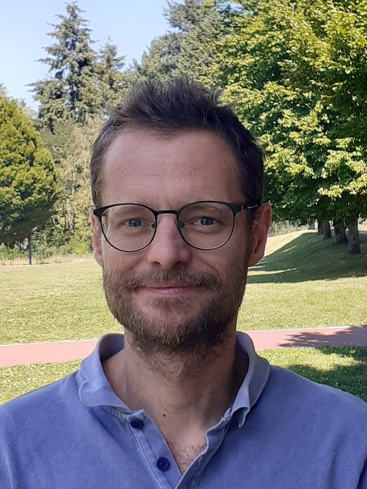

## Nom d'utilisateur

 PAGEA

## Contact

 arnaud.page@sorbonne-universite.fr

## Thèmes de recherche

 Histoire des sciences
Histoire de l'agriculture et de l'environnement
Histoire de l'alimentation

## Ouvrage et direction de numéro de revue

 “The fertiliser trade”, numéro spécial de Jahrbuch für Wirtschaftsgeschichte / Economic History Yearbook, vol. 62, n°1, 2021 (avec Laurent Herment et Christine Strottman).
“A Long Awakening? Environmental Concerns in the United Kingdom since the ineteenth Century”, numéro spécial de la Revue Française de Civilisation Britannique, vol. 23, n°3, 2018.

## Article dans une revue

 “Pure White Bread? Bleached Flour, Contestations, and Regulations, 1900-1950”, Technology and Culture, vol. 64, n° 1, 2023, pp. 149-171.
“'The True Food of the Brain': Protéines et constructions raciales en Angleterre, 1840-1910”, Cahiers Victoriens et Edouardiens, n° 97, 2023.
“Glutenophilia: Chemistry and Flour Quality in Nineteenth-Century France and Great Britain”, Ambix (The Journal of the Society for the History of Alchemy and Chemistry), vol. 68, n° 4, 2021, pp. 365-384 (avec Maxime Guesnon).
“The 'Price of Nitrogen' at the End of the Nineteenth Century”, Jahrbuch für Wirtschaftsgeschichte / Economic History Yearbook, vol. 62, n° 1, 2021, pp. 49-70 (avec Laurent Herment).
“Fertilisers in the Long 19th Century and Beyond: Usage, Commercialisation and Production (c. 1800-1939)”, Jahrbuch für Wirtschaftsgeschichte / Economic History Yearbook, vol. 62, n° 1, 2021, pp. 1-18 (avec Laurent Herment et Christine Strottman).
“Fertility from Urban Wastes? The Case for Composting in Great Britain, 1920s-1960s”, Environment and History, vol. 25, n° 1, 2019, pp. 3-22. 
« Les préoccupations environnementales en Grande-Bretagne: entre visibilité et marginalisation (XIXe-XXIe siècles) », Revue française de civilisation britannique, vol. 23, n° 3, 2018.
“A Toxic System: Lord Douglas of Barloch and the Fight for 'Natural' Food and Water (1940s-60s)”, Revue française de civilisation britannique, vol. 23, n° 3, 2018.
“Meaningful Plots: Leisure, 'Rational Recreation' and the Politics of Gardening in British Allotments (mid 19th-mid 20th Centuries)”, Angles: French Perspectives on the Anglophone World, 2017.
“'The Greatest Victory which the Chemist has won in the Fight against Nature'? Nitrogenous Fertilisers in Great Britain and the British Empire, 1910s-1950s”, History of Science, vol. 54, n° 4, 2016, pp. 383-398.
« Un 'pivot' inamovible ? Genèse(s) et usages du Heartland de Halford J. Mackinder », Outre-Terre: Revue européenne de géopolitique, 2016, vol. 48, n° 3, pp. 357 - 369.
« Socialisme et sciences sociales : Sidney Webb et la création de la London School of Economics », Revue française de civilisation britannique, vol. 15, n° 4, 2010.

## Chapitre dans un ouvrage collectif

 « Guerres et fertilisation : essor des engrais azotés en France et en Grande-Bretagne, 1918-1960 », in Christophe Bonneuil, Margot Lyautey et Léna Humbert (éds.), Histoire des modernisations agricoles au XXe siècle, Rennes, Presses Universitaires de Rennes, 2021, pp. 39-52.
« Libéralisme et sciences sociales au tournant du 20e siècle en Angleterre », in Raphaële Espiet-Kilty (éd.), Libéralisme(s)?, Clermont-Ferrand: EHIC, 2010.
“The 'crisis of modernity' and Graham Wallas: a modernist turn in the British study of politics?”, in Trevor Harris (ed.), Art, Politics and Society in Britain (1880-1914): Aspects of Modernity and Modernism, Newcastle upon Tyne: Cambridge Scholars Publishing, 2009, pp. 107-120.

## Interventions orales récentes

 “'Developing the African”: Competing visions in The Gambia, 1945-50”, journée d'études “Low Modernism: Developing Step by Step”, CRH, EHESS, 5 juin 2024.
« 'L'élément vital': Azote, quantification et nutrition ». Séminaire “Histoire environnementale: débats et recherches en cours” (GRHEN, CRH, EHESS), 20 octobre 2023.
“Microbes to the rescue”: bacteria and legumes in Britain, 1898-1914”,  Workshop on “Good environmental practices”, Maison Française d'Oxford (UK), 14 juin 2023 (en ligne). 
« Libre-échange et agronomie: économie des flux métaboliques chez le révérend Anthony Huxtable (Angleterre, c. 1850) », séminaire Terre, travail, politique, environnement: histoire des campagnes et des dynamiques agroalimentaires (ERHIMOR, CRH, EHESS), 17 janvier 2023.
“Sustaining Power? Edward Smith and Dietaries in British Workhouses and Prisons (1860s)”, Colloque Power and Knowledge from the 18th Century to Today, Université de Lorraine, 24-26 novembre 2022. 
« 'The true Brain Food':  protéines et constructions raciales durant les périodes victorienne et édouardienne », Atelier SFEVE, Congrès SAES, Clermont-Ferrand, 2-4 juin 2022.
“Chemical subjects: the science of food in the nineteenth century”, Workshop on British history of science and technology, Université d'Amiens, 3 décembre 2021.
« Rationaliser la nutrition: une histoire de l'azote, 1840-1914 », Séminaire franco-britannique d'histoire, Sorbonne Université, 18 novembre 2021.
“Nitrogen, the staff of life: measuring food intake before the calorie”, Food History Seminar, Institute of Historical Research, Londres (UK), 4 mars 2021 (en ligne).
« Essor des engrais azotés: une comparaison franco-britannique, 1914-1960 », Séminaire d'histoire environnementale de la France, EHESS, Paris, 20 janvier 2021 (en ligne).
“'Flesh-forming substances': Proteins in Museums, Cookery Books and Advertisement in the Victorian Era”, North American Conference on British Studies, 15 Novembre 2020, Chicago (en ligne).
“Poisoned bread? Bleached flour and new forms of adulteration in 20th c. Britain”, Workshop 'Bodies at stake: Occupational and Environmental Poisons in industrial societies (late 18th-21st c.)', Maison Française d'Oxford (UK), 14 février 2019. 
“The quantification of life: nitrogen and human nutrition in the 19th century”, “Socialising Nitrogen” Conference, Lancaster Environment Centre (UK), 27 novembre 2018.

## Vulgarisation et interventions dans les média

 Invité de l'émission “Le Cours de l'Histoire”, France Culture, 2 juin 2022: “Chimie à la ferme, pollution intensive”.

## Organisation d'événements et partenariats

 2015-aujourd'hui		Séminaire franco-britannique d'histoire (Sorbonne Université) : Co-organisateur, en partenariat avec AGORA (CYU), CREW (Sorbonne Nouvelle), le LARCA (U. de Paris) (20 séances par an). 
5 juin 2024	 Organisation de la journée d'études: « 'Bas-modernismes' : le développement à petits pas ? », CRH, EHESS.
23-25 mars 2023	Membre du comité d'organisation du colloque « Contours du bien-être et de la santé » (HDEA / Sorbonne Université). 
15 novembre 2020		“Nutrition beyond the lab” : organisation d'une session, North American Conference on British Studies, Chicago (en ligne en raison de la crise sanitaire). 
10-13 septembre 2019	“Grading and the food grain chain : Assessing the end-use qualities of wheat and other cereals” : co-organisation d'une session, Rural History Conference, Paris, en collaboration avec Jonas Marian Albrecht (JKU Linz, Autriche). 
11-14 septembre 2017	“Fertilisers in the long 19th century and beyond: Uses, commercialisation and production”: co-organisation de 3 sessions, Rural History Conference, Université de Louvain, Belgique en collaboration avec Laurent Herment (CNRS / EHESS) & Christine Strotmann (Humboldt Universität zu Berlin).
16 juin 2017		Organisation de la journée d'études :	“Environmental questions in Great Britain: Between visibility and marginalisation”, Sorbonne Université.

## Autres / Divers

 Directeur-Adjoint de l'Unité de Recherches HDEA
Coordinateur L3 et Directeur de la Licence LLCE études anglophones, Sorbonne Université

## Lien(s) vers autres pages

 https://sorbonne-fr.academia.edu/ArnaudPage
https://hal.archives-ouvertes.fr/search/index/?q=%2A&authIdHal_s=arnaud-page

