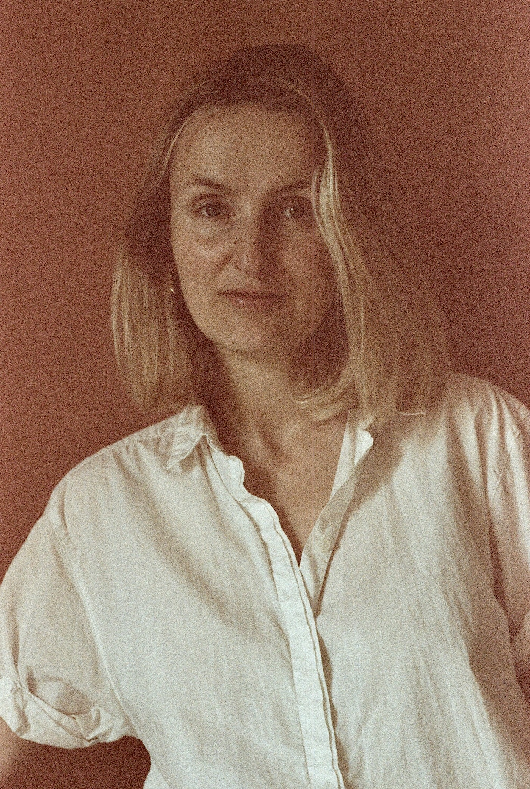

## Nom d'utilisateur

 Anonymous

## Contact

 carolin.gorgen [at] sorbonne-universite.fr

## Thèmes de recherche

 Carolin Görgen is Associate Professor of American Studies in the Department of English and American Studies (UFR Études Anglophones). She specializes in the history of photography and the environmental history of the American West. After having studied in the Netherlands, France, and the United States, she completed a joint PhD in American Studies and Art History at Université Paris-Diderot and the École du Louvre in 2018. Her thesis on the California Camera Club was awarded the research prize of the German Photographic Society & the Deutsche Börse Photography Foundation. It is forthcoming as a monograph with the University of Oklahoma Press in 2025. Görgen's current research focuses on the environmental practices of western American photography. 

Research topics:
- History of American photography
- Environmental history of California and the American West
- American art (19th and 20th centuries)

## Ouvrage et direction de numéro de revue

 Carolin Görgen, The California Camera Club: Collective Visions in the Making of the American West. University of Oklahoma Press, forthcoming 2025.

Carolin Görgen & Camille Rouquet, editors, “Camera Memoria: Photographic Histories from the Margins,” special journal issue Miranda: Journal of the English-speaking World (2022)
https://journals.openedition.org/miranda/44163

## Article dans une revue

 Selection of articles:

Görgen, Carolin. “Vienna to San Francisco via Chicago: Camera Club Exchanges in the 1890s,” Transatlantic Cultures, 2023.

Görgen, Carolin. “Everyday Photography? Politicizing a 'vernacular' photo album of the San Francisco Earthquake and Fire of 1906,” Interfaces: Image Text Language, No. 44, 2021, pp. 29-51.

Görgen, Carolin. “'San Francisco on a thousand plates' - New perspectives on photo-historical research around 1900 through the lens of the California Camera Club,” Interfaces: Image Text Language, No. 41, 2019, pp. 7-24.

Görgen, Carolin. “Des cendres à la nouvelle métropole. Le California Camera Club et la reconstruction photographique de San Francisco au lendemain du tremblement de terre et de l'incendie de 1906,” Transbordeur: Photographie Histoire Société, No. 2, 2018, pp. 186-199.

Görgen, Carolin. “Historiens du territoire et de la pratique : Les photographes du California Camera Club,” Histoire de l'Art, No. 80, 2017.

## Chapitre dans un ouvrage collectif

 Görgen, Carolin. “Ruines Écologiques du Tremblement de Terre de San Francisco,” in Les formes de la Ruine, eds. Alain Schnapp and Sylvie Ramond (Lyon and Paris: Musée des Beaux-Arts de Lyon and Lienart, 2024).

Görgen, Carolin. “Toward a 'History of Uses': Photographic Dissemination in the Early Twentieth-century American West,” in Factuality and Utilization of Early Photography, eds. Tatjana Bartsch et al. (Berlin and Leipzig: German Archeological Institute & Harrassowitz Verlag, 2022).

Görgen, Carolin. “Arnold Genthe and the California Camera Club,” in Among the Ruins: Arnold Genthe's Photographs of the 1906 San Francisco Earthquake and Firestorm, eds. Karin Breuer and James A. Ganz (San Francisco and Petaluma: Fine Arts Museums of San Francisco and Cameron & Co., 2021).

## Interventions orales récentes

 “Landscape and Power: Constructing California Environmentalism through the Camera,” Annual Congress of the French Association for American Studies (AFEA), Aix-en-Provence, May 24, 2024

“'I know what I'm doing' - Female Empowerment and Gendered Ideas of Photography in the Transatlantic Camera Club Network,” Keynote for the conference “Love and Lenses: Photographic Couples, Gender Relationships, and Transatlantic Networks,” Maison Française d'Oxford & Rothermore American Institute, Oxford, UK, Oct. 12, 2023

“Women Photographers in the West Coast Camera Club Environment, c. 1900,” Cascadia Art Museum, Seattle, Aug. 30, 2023

“Californie 1900: Circulating California's Environmental Imagination at the Paris World's Fair,” Seminar of the Department of European Languages and Transcultural Studies, University of California Los Angeles, Sept. 27, 2023

“Camera Clubs against the Canon: Writing a Californian Club back into U.S. Photo-history,” Conference “Photographic Societies and Camera Clubs,” History and Theory of Photography Research Centre, Birkbeck, University of London, May 25, 2023

## Vulgarisation et interventions dans les média

 “Another West: Ecologies of Photography,” Blog post with Monica Bravo for Verso - Blog of the Huntington Library, 2024
https://huntington.org/verso/another-west-ecologies-photography

“Politicizing vernacular photographs of the San Francisco Earthquake and Fire,” Apr. 20, 2021, California Historical Society, San Francisco & online; aired on U.S. television C-SPAN in 2021. 
Watch: https://www.youtube.com/watch?v=AMQXdYOqonw

## Organisation d'événements et partenariats

 2025 Co-organization of two panels “New Directions in the Politics of American Photography” with Matthew Fox-Amato (University of Idaho) at the Annual Congress of the Organization of American Historians, Chicago

2024 Co-organization of the international symposium “Ecologies of Photography: Materials, Industries, and Environment in the American West” with Monica Bravo (Princeton) at The Huntington Library, Art Museum, and Botanical Gardens
https://huntington.org/ecologies-photography

Since 2022 Co-organization of the monthly research seminar HDEA/Sorbonne with Sandrine Parageau 

Since 2019 Member of the editorial board of the journal Photographica https://journals.openedition.org/photographica/

2016 - 2019 Co-organization of the monthly seminar “Camera Memoria: Seminar on the histories of photography in the English-speaking world” with Camille Rouquet at Université Paris-Diderot (https://camemoria.hypotheses.org)

## Autres / Divers

 Fellowships and distinctions 

2025 Fulbright Visiting Scholar, University of California Los Angeles

2024 Archibald Hanna Fellowship in American History, Beinecke Library, Yale University

2023 Thomas Mann Senior Fellowship, Los Angeles, California

2021 Davidson Family Fellowship, Amon Carter Museum of American Art, Fort Worth, Texas

2020 International Research Award “Thinking Photography” by the German Photographic Society and Deutsche Börse Photography Foundation

2019 Short-term fellowship, The Huntington Library, Art Museum & Botanical Gardens, San Marino, California

2019 Peter E. Palmquist Memorial Fund for Historical Photographic Research by the
Humboldt Area Foundation, Bayside, California

2017 Terra Summer Residency, Terra Foundation for American Art, Giverny, France

2016 Terra Foundation for American Art three-months travel grant to the U.S.

## Lien(s) vers autres pages

 https://sorbonne-universite.academia.edu/CarolinG%C3%B6rgen

