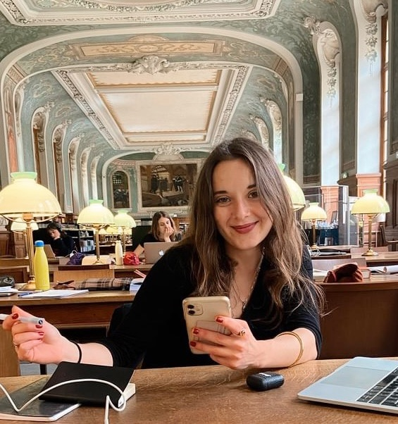

## Nom d'utilisateur

 Anonymous

## Contact

 coline.bohbot@gmail.com

## Thèmes de recherche

 Thanatologie, 18ème siècle, Littérature, Histoire, Religion, Médecine.

## Interventions orales récentes

 Journée d'Études "Au lit!", Bureau OVALE, Laboratoire VALE : "Deathbed sociability in Clarissa by Samuel Richardson"

